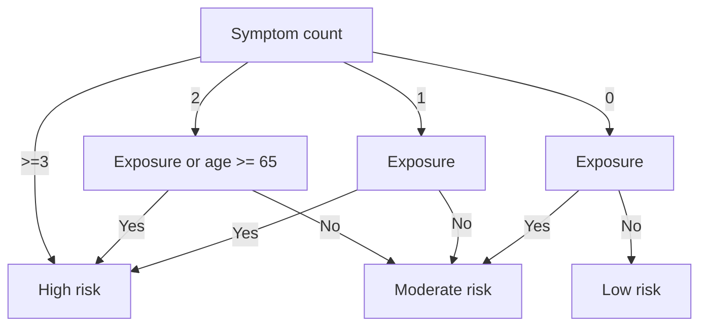

# COVID HealthCheck

This is a RapidPro flow that implements a simplified version of the COVID HealthCheck available on the ContactNDoH WhatsApp line. 
It is simplified in the following ways:
- There is no call to the Google Places API as a fallback for location pins. Instead, providing location is optional. This means that it is an entirely self-contained service that runs just inside RapidPro
- There are no integrations with the NDoH, healthcheck results are just stored within RapidPro.

There are two sections of data collection, the first is profile data, and the second is symptom data. 
The profile data is used for reporting, and to help the government make decisions. 
The symptom data is what is used to determine risk level, and to let the person doing the HealthCheck know what action they should be taking.
New users are asked both the profile and the symptom data, but returning users are just asked the symptom data. 
This helps with reducing the time it takes to complete repeat HealthChecks, as the profile data doesn't change often, and isn't used to determin risk level. 

## Data collected
The data collected is as follows:

Profile data:
- Age bracket
- Gender
- Province
- Location (optional)
- Pre-existing Conditions (Obesity, Diabetes, Hypertension, Cardiovascular Disease)

Symptom data:
- Fever
- Cough
- Sore throat
- Difficulty breating
- Loss of taste or smell
- COVID-19 exposure

## Risk level
There is an algorithm to determine their risk level.
- High risk: get tested
- Moderate risk: self-quarantine
- Low risk: check again in 7 days

